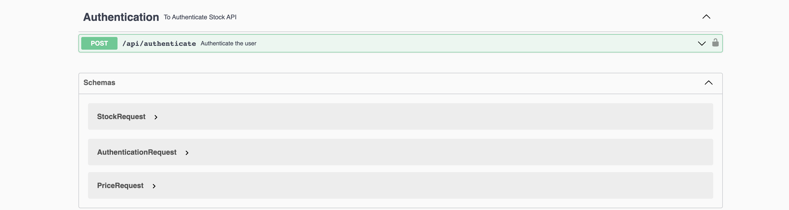
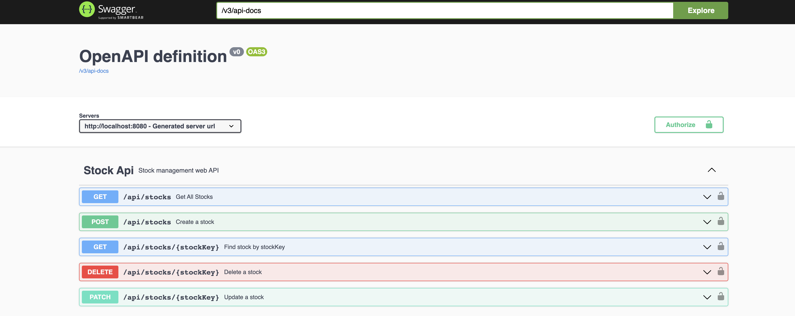
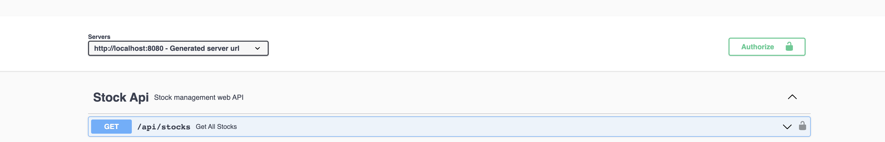

# Payconiq Assignment
It is a standalone REST java application which allows users to manage their stocks. It allows create new stock, update existing stock, delete stock and fetch all stocks.

# Tech Stack
- Java 11
- Spring Boot
- H2 database
- Documented with Swagger
- Unit Tests
- Integration Tests
- Logging
- Exception Handling

# OpenAPI Specification
  - As the first step designed the api in swagger openApi editor and generate the yaml file
    [swaggerOpenAPIdocument](./documentation/payconiq-assignment-openApi.yaml)

# Swagger API Documentation

- You can see API documentation http://localhost:8080/swagger-ui/index.html?configUrl=/v3/api-docs

_

# Build & Run on Docker

This is a step-by-step guide how to build and run the project using Docker.

- First you need to install dependencies by running clean and install maven commands.
- Then to build and run the project on docker, you need to run following commands:
    - docker build -t assignment-0.0.1.jar .  //make sure you are in project directory
     -docker images (to see if image is build)
    -  docker run -p:8080:8085 assignment-0.0.1.jar
- Once you run the server you can access the project at port 8080.
- You can see API documentation http://localhost:8080/swagger-ui/index.html?configUrl=/v3/api-docs

#Steps to access Stock API 

 - First need to authenticate with user and password to generate JWT 
 - userName: payconiqUser
 - password: testpassword
 - Pass the JWT in Authorize popup
   
 - After authorize this bearer token will add in stock api request header

Footer
© 2022 GitHub, Inc.
Footer navigation
Terms
Privacy
Security
Status
Docs
Contact GitHub
Pricing
API
Training
Blog
About
